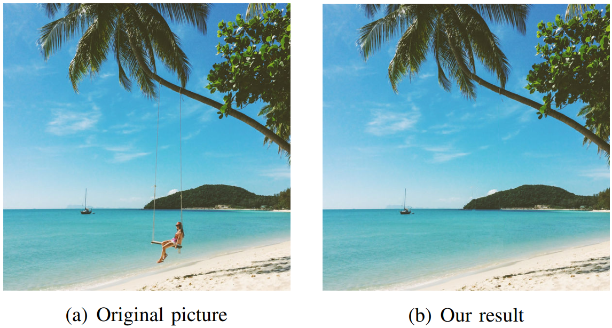

# PatchMatchMagic

## Overview

This project implements an interactive image inpainting tool in MATLAB, using the Wexler method for reconstruction with the PatchMatch algorithm to accelerate the process. Image inpainting is the task of reconstructing occluded or missing parts of an image in a manner that looks natural to the human eye.

## Description

The implemented tool allows users to select an occluded region of an image through a graphical user interface (GUI) and then reconstructs the missing parts using advanced algorithms. The Wexler method, a patch-based multi-resolution pyramidal reconstruction algorithm, is used for the inpainting task. This method transforms the problem into a mathematical optimization challenge aimed at maximizing global coherence in the image.

To enhance the efficiency of the reconstruction, the PatchMatch algorithm is integrated. PatchMatch is a patch research method that utilizes a randomized correspondence table improved by a propagation and randomized search mechanism. This approach significantly reduces the computational load compared to brute-force search methods.

For more detailed information about the implementation and results, please refer to the [paper](docs/Image_Inpainting_using_Wexler_and_PatchMatch_algorithm.pdf).

## Features

- **Interactive GUI:** Users can easily select the region to be inpainted using a graphical user interface.
- **PatchMatch Algorithm:** Accelerates the patch searching process, making the reconstruction faster.
- **Wexler Reconstruction Method:** Ensures smooth and coherent reconstruction of the masked image.

## References

- Wexler, Y., Shechtman, E., & Irani, M. (2007). Space-time completion of video. IEEE Transactions on Pattern Analysis and Machine Intelligence, 29(3), 463-476.
- Barnes, C., Shechtman, E., Finkelstein, A., & Goldman, D. B. (2009). PatchMatch: A randomized correspondence algorithm for structural image editing. ACM Transactions on Graphics (TOG), 28(3), 1-11.

## License

This project is licensed under the MIT License - see the [LICENSE](LICENSE) file for details.
